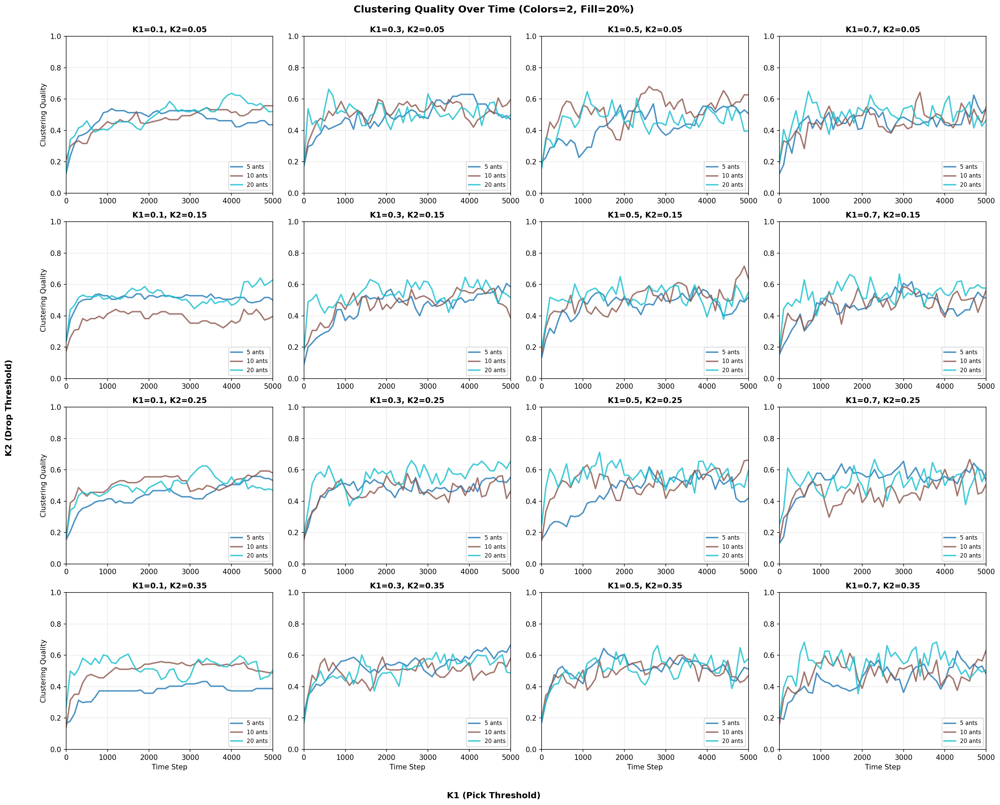
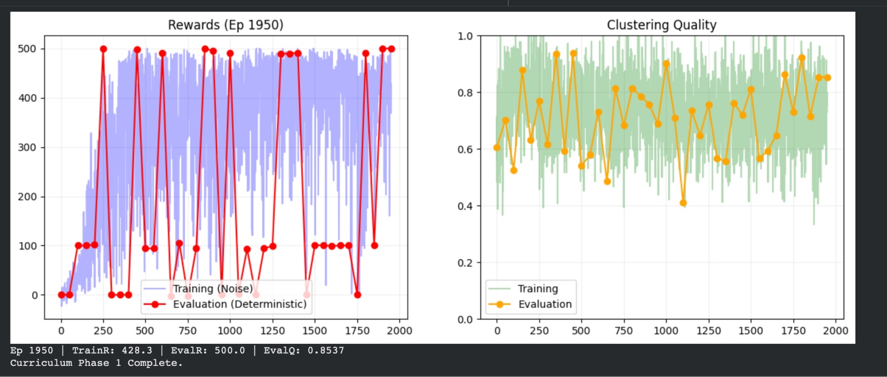
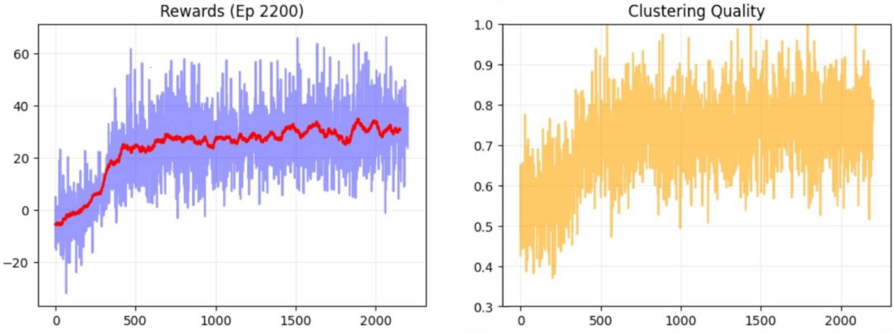
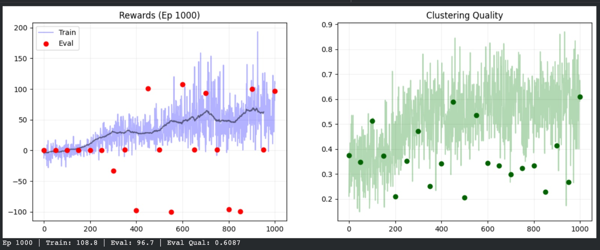

# Learning Ants for Object Sorting: A Comparative Study of Rule-Based and Reinforcement Learning Approaches

**Authors:** Daniel Escobar & Noah van Potten  
**Institution:** ELTE University Budapest  
**Course:** Computational Intelligence, Fall 2025

---

## Abstract

This project investigates the ant sorting problem, where autonomous agents must organize colored items on a 2D grid into clusters. We compare three approaches: (1) a rule-based baseline using classical Deneubourg pick/drop rules, (2) a reinforcement learning (RL) approach using REINFORCE policy gradient for single-color clustering, and (3) RL approaches for multi-color sorting with various architectural innovations. Our experiments demonstrate that RL agents successfully learn clustering mechanics, achieving quality scores of 0.85-0.95 for single-color clustering. However, multi-color sorting proves significantly more challenging, with quality scores ranging from 0.31-0.61. We identify key challenges including exploration-exploitation trade-offs, reward structure limitations, and the complexity gap between clustering and sorting tasks. The results highlight the importance of reward design and evaluation methodology in multi-agent reinforcement learning systems.

**Keywords:** Reinforcement Learning, Ant Sorting, REINFORCE, Policy Gradient, Multi-Agent Systems, Clustering

---

## 1. Environment

### 1.1 Grid World

The simulation environment consists of a 2D bounded grid where agents interact with colored objects. Grid sizes vary by experiment: reinforcement learning uses 10×10 grids, while baseline experiments use 20×20 grids to accommodate multiple simultaneous agents. The grid has no wrapping, creating a finite bounded workspace. Objects are randomly placed with configurable fill percentages (20-40%), where 20% represents sparse and 40% represents dense configurations. Initial placement ensures even distribution across color types, supporting experiments with 1-3 colors for both clustering (single color) and sorting (multiple colors) tasks.

### 1.2 Agent Capabilities

Each ant agent observes a 3×3 local neighborhood (9 cells) and tracks its carrying state, knowing whether it holds an item and its color. Movement is restricted to four cardinal directions (up, down, left, right), creating a discrete action space. Agents can pick up items from their current cell, drop items onto empty cells, or perform a no-op action to remain stationary. Throughout operation, agents maintain awareness of their internal state, specifically whether they are carrying an item and its color identity.

### 1.3 Observation Space

For reinforcement learning agents, the observation vector combines multiple components: the 3×3 neighborhood encoded as one-hot vectors (empty + color types), the carrying state as a one-hot vector, and 9 binary match signals indicating whether each neighbor matches the held item's color. In momentum experiments, the observation includes the last action taken as a one-hot vector, helping break symmetry and stabilize movement. For example, a 2-color sorting task with momentum yields 46 features: (10 cells × 3 states) + 9 match signals + 7 action memory slots.

### 1.4 Action Space

The action space consists of 7 discrete actions: 4 movement directions (actions 0-3), pick item (action 4), drop item (action 5), and no-op (action 6). Actions are masked to prevent invalid operations, such as picking when already carrying, dropping when empty, or moving outside grid boundaries. This masking mechanism guides exploration toward valid behaviors and improves learning efficiency.

### 1.5 Clustering Quality Metric

The primary evaluation metric calculates clustering quality as the ratio of adjacent matching pairs to total items. The metric counts horizontally or vertically adjacent cells containing items of the same color, normalized by total item count for comparability across densities. Scores range from 0.0 (random distribution) to 1.0 (perfect clustering). However, this metric measures clustering but does not explicitly penalize mixed-color clusters in sorting tasks, which becomes a limitation when evaluating multi-color sorting performance where color separation is the true objective.

---

## 2. Methods

### 2.1 Rule-Based Baseline (Deneubourg Model)

The baseline implements classical ant clustering rules based on local similarity. The pick rule uses `P_pick = (k1 / (k1 + similarity))²`, where higher probability occurs when local similarity is low (item doesn't fit), with parameter k1 controlling pick sensitivity. The drop rule uses `P_drop = (similarity / (k2 + similarity))²`, where higher probability occurs when local similarity is high (item fits well), with parameter k2 controlling drop sensitivity. Movement follows random 8-directional patterns including diagonals.

Multiple ants operate simultaneously (5, 10, or 20 ants), each making independent pick/drop decisions based on their local neighborhood. The system uses deterministic probabilistic rules with no learning or adaptation. Parameter sweeps tested K1 ∈ [0.1, 0.3, 0.5, 0.7] and K2 ∈ [0.05, 0.15, 0.25, 0.35], yielding clustering quality ranges of 0.3-0.6 depending on parameters. More ants generally improve performance, though optimal parameters vary with grid configuration.

The approach demonstrates stable and predictable behavior with fast execution requiring no training, interpretable rules, and consistent performance. However, it suffers from fixed rules with no adaptation, limited peak performance, and requires manual parameter tuning.

---

### 2.2 RL Approach: Single-Color Clustering

The single-color clustering approach uses a multi-layer perceptron (MLP) policy network with 2 hidden layers of 128 units each, ReLU activation, and dropout (0.1), outputting action probability distributions over 7 actions. Training employs REINFORCE (Monte Carlo Policy Gradient) with Adam optimizer (learning rate 1e-3), discount factor γ = 0.99, entropy regularization 0.01, gradient clipping (max_norm = 1.0), and runs for 3000 episodes with 400 steps per episode.

The reward structure combines global and auxiliary components: global reward equals the change in clustering score multiplied by 100.0, while auxiliary rewards provide +0.5 for picking strays, -1.5 for breaking clusters, -1.0 for littering, and +1/+2/+4 density bonuses for dropping near 1/2/3+ neighbors. During training, actions are sampled stochastically for exploration, while evaluation uses deterministic argmax every 50 episodes on separate grids not seen during training.

Results show training rewards with mean ~428.3 and high variance, while evaluation rewards oscillate between 0-500 with peaks around 500 (favorable initializations) and valleys around 100 (missed items). Clustering quality peaks at 0.85-0.95 (excellent clustering) and valleys at 0.5-0.6 (partial clustering), with final quality of 0.8537. The agent successfully learned clustering mechanics ("pick lonely, drop friendly") and achieves high-quality clustering when items are found. However, deterministic evaluation shows high variance (sawtooth pattern) and limited exploration causes missed items. The 3×3 vision limitation combined with deterministic search patterns creates blind spots where items outside the search path are never discovered.

---

### 2.3 RL Approach: Multi-Color Sorting (Non-Deterministic)

This approach adapts the single-color architecture for multiple colors (2-3 colors depending on configuration), resulting in a larger observation space due to multiple color encodings. The key difference is fully stochastic evaluation with no deterministic mode, meaning all actions use stochastic sampling throughout training. This maintains exploration continuously and simplifies the training loop by eliminating mode switching.

Results show training rewards with mean ~30-35 and high variance. Clustering quality starts at 0.3-0.4, improves to 0.6-0.8 after approximately 400 episodes, and shows consistent improvement over time. The approach demonstrates more consistency than deterministic evaluation, avoids the sawtooth pattern, and shows better robustness across initializations. However, it achieves lower peak performance due to stochastic exploration, and sorting quality remains lower than single-color clustering. The fully stochastic approach trades peak performance for robustness, with multi-color sorting proving significantly harder than single-color clustering, plateauing around 0.6-0.8 compared to 0.85-0.95 for single-color.

---

### 2.4 RL Approach: Multi-Color Sorting (Deterministic with Momentum)

This approach introduces action memory (momentum) as an architectural innovation, storing the last action taken and including it as a one-hot encoding in the observation space. This enhancement breaks the symmetry of empty space and helps stabilize movement patterns. The observation space expands to include vision, match signals, and last action memory, with input size calculated as `(10 × (NUM_COLORS + 1)) + 9 + 7` features.

Training configuration uses 2 colors, 2500 episodes, 400 steps per episode, deterministic evaluation every 50 episodes, and a StepLR learning rate scheduler (step_size=800, gamma=0.5).

Results show training rewards with mean ~30-35 and high variance (-20 to 60). Evaluation rewards are highly variable (-100 to 110), starting near zero or negative in early episodes (0-200), oscillating between -100 and +110 in mid episodes (300-600), and stabilizing around +100 in late episodes (900-1000). Clustering quality in training ranges from 0.3-1.0, improving to 0.6-0.8, while evaluation quality ranges from 0.2-0.6 with high variability, achieving a final quality of 0.6087. Action memory helps break symmetry and stabilizes movement patterns, but the approach still shows high variance in deterministic evaluation. Sorting quality (0.31-0.61) remains significantly lower than clustering (0.85-0.95), demonstrating the task complexity gap. The momentum mechanism provides architectural improvement but doesn't fully solve the exploration problem, with multi-color sorting remaining challenging and showing only partial success in color separation.

---

## 3. Challenges

### 3.1 Task Complexity Gap

A significant performance gap exists between single-color clustering (quality 0.85-0.95) and multi-color sorting (quality 0.31-0.61). This gap stems from fundamental task differences: clustering requires grouping similar items, which is relatively straightforward, while sorting requires separating different colors into distinct clusters, which is substantially harder. The agent must learn color discrimination implicitly from the global reward signal, as the reward structure doesn't explicitly encourage color separation. This leads to a significant performance drop when moving from 1 to 2+ colors, and agents may create mixed-color clusters that still score well on the global metric without achieving true sorting.

### 3.2 Exploration-Exploitation Trade-off

Deterministic evaluation exhibits high variance with a sawtooth pattern, misses items outside the search path, and suffers from limited exploration leading to suboptimal coverage. The 3×3 vision creates blind spots that exacerbate this problem. Stochastic evaluation provides better exploration and consistency with improved robustness across initializations, but trades off peak performance and slower convergence. The core challenge lies in finding the right balance between exploration (stochastic) and exploitation (deterministic) for evaluation, as each approach has distinct advantages and limitations.

### 3.3 Reward Structure Limitations

The current reward structure uses a global component based on change in clustering score that doesn't distinguish colors, combined with auxiliary density-based shaping that is color-agnostic. This design doesn't explicitly penalize mixed-color clusters or reward color-specific clustering, forcing the agent to infer color separation from the global signal. As a result, agents may converge to suboptimal mixed-color solutions that achieve high clustering scores without proper color separation. A color-aware reward structure that explicitly encourages color separation is needed to address this limitation.

### 3.4 Vision Limitations

The 3×3 local neighborhood (9 cells) provides limited global awareness, preventing agents from seeing distant clusters and making it difficult to plan long-term paths. This constraint may cause agents to get stuck in local optima. Potential solutions include expanding the vision radius (5×5, 7×7), implementing memory mechanisms such as LSTM or attention, or developing hierarchical planning approaches that enable better spatial reasoning.

### 3.5 Evaluation Methodology

Deterministic evaluation shows high variance where the same policy produces vastly different results across different initializations, indicating sensitivity to starting conditions and making performance assessment difficult. Stochastic evaluation provides more consistency but doesn't reveal best-case performance, makes convergence assessment harder, and may mask underlying policy quality. The challenge is developing an evaluation methodology that balances consistency with accurate performance assessment, as current approaches either sacrifice consistency for peak performance or sacrifice peak performance for consistency.

### 3.6 Training Stability

Training exhibits high variance in rewards, oscillatory evaluation metrics, slow convergence for multi-color tasks, and sensitivity to hyperparameters. Contributing factors include sparse rewards that only occur when clustering improves, long episode lengths (400 steps) that complicate credit assignment, and the inherent difficulty of balancing exploration and exploitation. These factors combine to create unstable training dynamics that require careful hyperparameter tuning and extended training periods to achieve convergence.

---

## 4. Comparative Analysis

### 4.1 Performance Summary

| Approach | Task | Peak Quality | Consistency | Exploration | Best Use Case |
|----------|------|-------------|-------------|-------------|--------------|
| **Rule-Based** | 2-color | 0.3-0.6 | High | Fixed | Baseline comparison |
| **RL_1Color** | 1-color clustering | 0.85-0.95 | Low (eval) | Limited | Single-color clustering |
| **RL_2Color_noDeterministic** | 2-color sorting | 0.6-0.8 | Medium | High | Robust sorting |
| **RL_2Color_Deterministic_momentum** | 2-color sorting | 0.31-0.61 | Low | Limited | Best-case performance |

### 4.2 Architectural Innovations

Several architectural innovations were explored throughout the project. Match signals help identify where to drop items and provide local clustering guidance, successfully integrated into the observation space. Action memory (momentum) breaks the symmetry of empty space and stabilizes movement patterns, though it provides only modest improvement and doesn't solve core challenges. Reward shaping through density bonuses effectively guides clustering behavior for single-color tasks but proves insufficient for multi-color sorting, highlighting the need for color-aware reward components.

### 4.3 Key Insights

The comparative analysis reveals several critical insights. First, a clear complexity gap demonstrates that sorting is fundamentally harder than clustering, with performance dropping significantly when moving from single-color to multi-color tasks. Second, evaluation mode matters significantly: deterministic evaluation shows best-case performance but high variance, while stochastic evaluation shows consistency but lower peaks. Third, reward design is critical, as the current structure works for clustering but is insufficient for sorting, necessitating color-aware rewards. Fourth, exploration is essential, as limited exploration in deterministic mode causes performance degradation, while stochastic exploration improves robustness. Finally, vision limitations are evident, as 3×3 vision creates blind spots, indicating that larger vision or memory mechanisms are needed for better performance.

---

## 5. Conclusion

This project successfully demonstrates learning-based approaches to ant sorting, achieving high-quality clustering (0.85-0.95) for single-color tasks using REINFORCE policy gradient methods. The main contributions include successful RL implementation demonstrating that REINFORCE can learn effective clustering policies, architectural innovations such as match signals and action memory that improve performance, comprehensive comparative analysis of rule-based and learning-based approaches, and identification of key limitations in reward structure, exploration, and evaluation methodologies.

However, multi-color sorting proves significantly more challenging, with quality scores ranging from 0.31-0.61, revealing a substantial complexity gap between clustering and sorting tasks. RL agents successfully learn clustering mechanics for single-color scenarios, but deterministic evaluation shows high variance, and the current reward structure lacks color-aware components necessary for effective multi-color sorting. The gap between clustering (0.85-0.95) and sorting (0.31-0.61) performance underscores the need for improved reward structures and exploration strategies.

Future work should focus on several key directions: designing color-aware rewards that explicitly penalize mixed-color clusters and reward color separation, developing hybrid exploration strategies combining stochastic and deterministic approaches, experimenting with larger vision radii or memory mechanisms to address vision limitations, implementing curriculum learning to gradually increase task complexity, and exploring communication or coordination mechanisms between multiple agents. These improvements are essential to bridge the performance gap and achieve robust multi-color sorting capabilities in learning-based ant systems.
