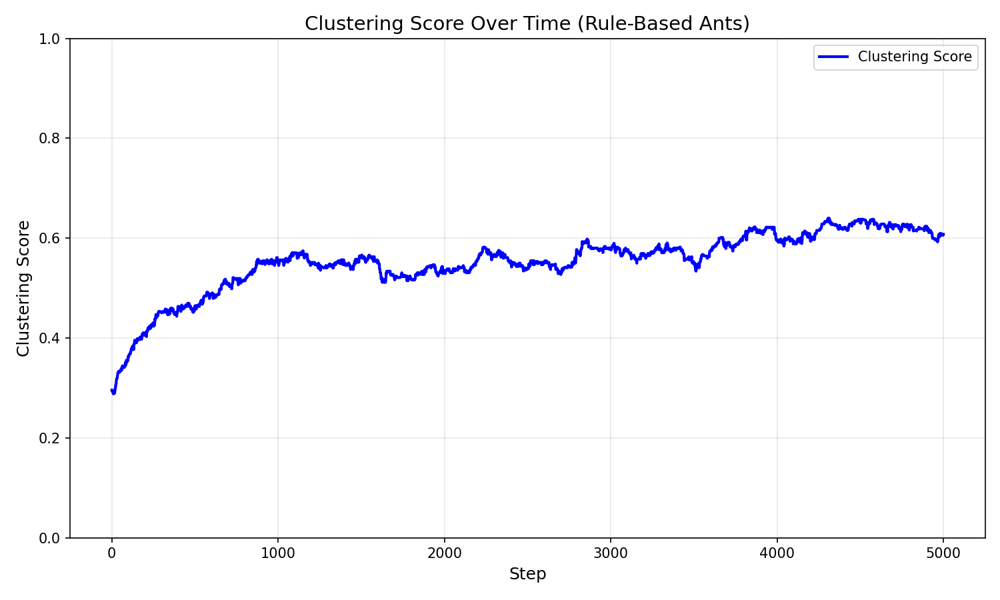
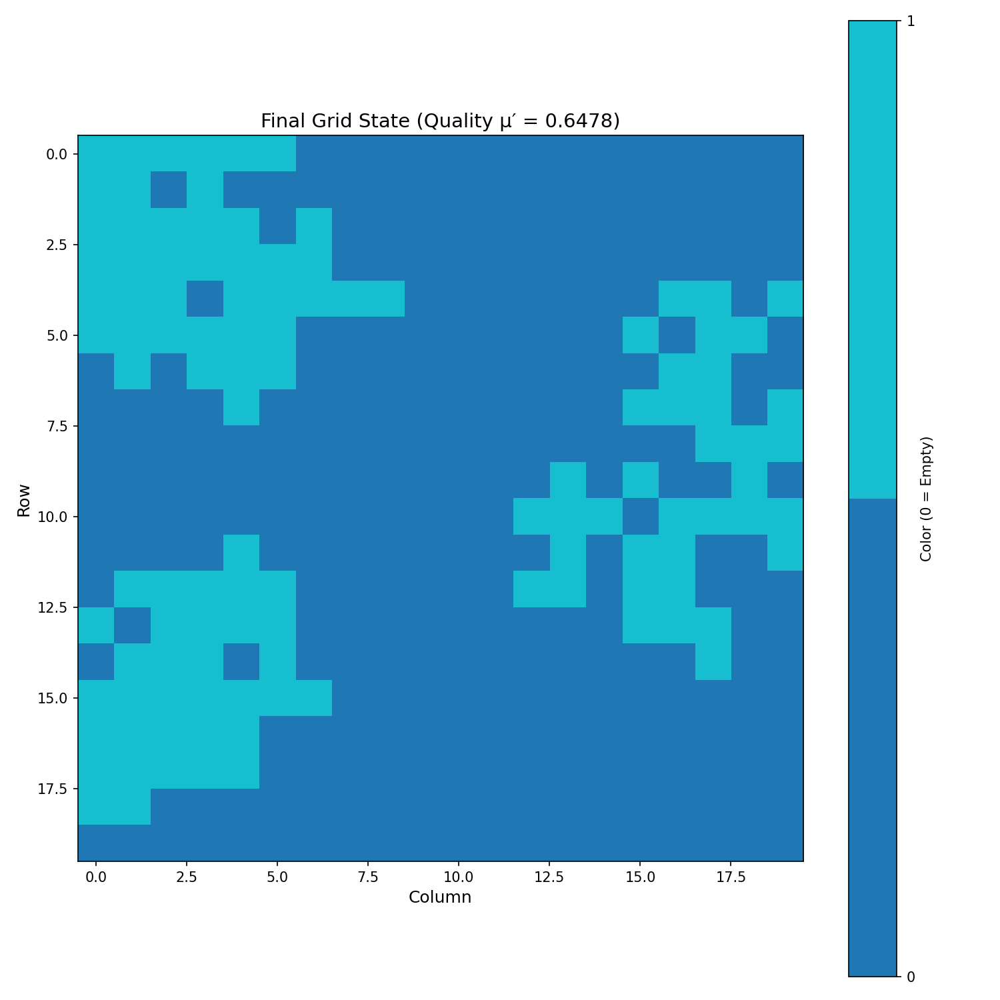
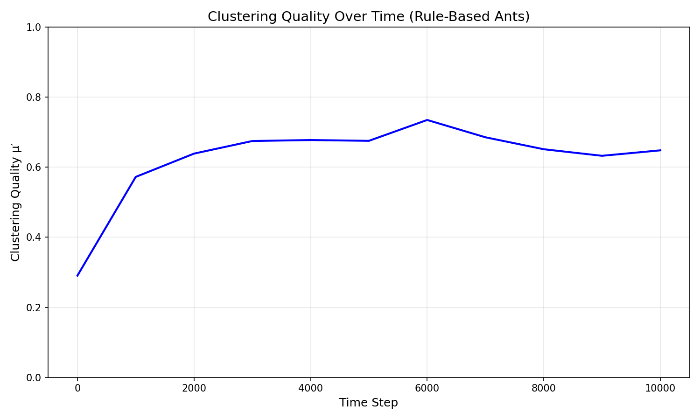

# Learning Ants for Object Sorting: A Comparative Study of Rule-Based and Reinforcement Learning Approaches

**Authors:** Daniel Escobar & Noah van Potten  
**Institution:** ELTE University Budapest  
**Course:** Computational Intelligence, Fall 2025

---

## Abstract

This project investigates the ant sorting problem, where autonomous agents must organize colored items on a 2D grid into clusters. We compare three approaches: (1) a rule-based baseline using classical Deneubourg pick/drop rules, (2) a reinforcement learning (RL) approach using REINFORCE policy gradient for single-color clustering, and (3) RL approaches for multi-color sorting with various architectural innovations. Our experiments demonstrate that RL agents successfully learn clustering mechanics, achieving quality scores of 0.85-0.95 for single-color clustering. However, multi-color sorting proves significantly more challenging, with quality scores ranging from 0.31-0.61. We identify key challenges including exploration-exploitation trade-offs, reward structure limitations, and the complexity gap between clustering and sorting tasks. The results highlight the importance of reward design and evaluation methodology in multi-agent reinforcement learning systems.

**Keywords:** Reinforcement Learning, Ant Sorting, REINFORCE, Policy Gradient, Multi-Agent Systems, Clustering

---

## 1. Environment

### 1.1 Grid World

The simulation environment consists of a 2D bounded grid where agents (ants) interact with colored objects:

- **Grid Configuration:**
  - Size: 10×10 (RL experiments) or 20×20 (baseline experiments)
  - Bounded grid (no wrapping)
  - Objects randomly placed with configurable fill percentage (20-40%)
  - Multiple color types (1-3 colors depending on experiment)

- **Object Distribution:**
  - Random initial placement
  - Even distribution across colors
  - Fill percentage determines density (sparse: 20%, dense: 40%)

### 1.2 Agent Capabilities

Each ant agent can:
- **Observe:** 3×3 local neighborhood (9 cells) + carrying state
- **Move:** Up, down, left, right (4 directions)
- **Interact:** Pick up items, drop items, or perform no-op
- **State:** Track whether currently carrying an item and its color

### 1.3 Observation Space

For RL agents, the observation includes:
- **Vision:** 3×3 neighborhood encoded as one-hot vectors (empty + color types)
- **Carrying State:** One-hot encoding of current item (or empty)
- **Match Signals:** 9 binary signals indicating if each neighbor matches held item
- **Memory (optional):** Last action taken (for momentum experiments)

**Example:** For 2 colors, input size = `(10 × 3) + 9 + 7 = 46` features

### 1.4 Action Space

7 discrete actions:
- 0-3: Move (up, down, left, right)
- 4: Pick item
- 5: Drop item
- 6: No-op

Actions are masked to prevent invalid operations (e.g., picking when empty, dropping when carrying).

### 1.5 Clustering Quality Metric

The primary evaluation metric measures how well similar items are clustered:

```
Clustering Score = (Sum of adjacent matching pairs) / (Total items)
```

- **Range:** 0.0 to 1.0
- **Interpretation:**
  - 0.0: No adjacent matching pairs (random distribution)
  - 1.0: Perfect clustering (all items adjacent to same-color neighbors)
- **Note:** This metric measures clustering but doesn't explicitly penalize mixed-color clusters in sorting tasks.

---

## 2. Methods

### 2.1 Rule-Based Baseline (Deneubourg Model)

#### 2.1.1 Approach

The baseline uses classical ant clustering rules based on local similarity:

**Pick Rule:**
```
P_pick = (k1 / (k1 + similarity))²
```
- Higher probability when local similarity is low (item doesn't fit)
- Parameter k1 controls pick sensitivity

**Drop Rule:**
```
P_drop = (similarity / (k2 + similarity))²
```
- Higher probability when local similarity is high (item fits well)
- Parameter k2 controls drop sensitivity

**Movement:** Random 8-directional movement (including diagonals)

#### 2.1.2 Implementation

- Multiple ants operate simultaneously (5, 10, or 20 ants)
- Each ant makes independent pick/drop decisions based on local neighborhood
- No learning or adaptation
- Deterministic probabilistic rules

#### 2.1.3 Results


**Parameter Sweep Analysis:**
- Tested K1 ∈ [0.1, 0.3, 0.5, 0.7] and K2 ∈ [0.05, 0.15, 0.25, 0.35]
- Clustering quality ranges: 0.3-0.6 depending on parameters
- More ants generally improve performance
- Optimal parameters vary with grid configuration

**Strengths:**
- Stable and predictable behavior
- Fast execution (no training required)
- Interpretable rules
- Consistent performance

**Limitations:**
- Fixed rules, no adaptation
- Limited peak performance
- Requires manual parameter tuning

---

### 2.2 RL Approach: Single-Color Clustering

#### 2.2.1 Architecture

**Policy Network:**
- MLP with 2 hidden layers (128 units each)
- ReLU activation, dropout (0.1)
- Output: Action probability distribution over 7 actions

**Training:**
- Algorithm: REINFORCE (Monte Carlo Policy Gradient)
- Learning rate: 1e-3 (Adam optimizer)
- Discount factor: γ = 0.99
- Entropy regularization: 0.01
- Gradient clipping: max_norm = 1.0
- Episodes: 3000, Steps per episode: 400

**Reward Structure:**
```
Total Reward = Global Reward + Auxiliary Reward

Global Reward = (Δ clustering_score) × 100.0

Auxiliary Rewards:
- PICK: +0.5 (stray) or -1.5 (cluster break)
- DROP: -1.0 (littering) or +1/+2/+4 (density bonus)
```

#### 2.2.2 Evaluation Strategy

- **Training:** Stochastic action sampling (exploration)
- **Evaluation:** Deterministic argmax (exploitation) every 50 episodes
- Separate evaluation grids not seen during training

#### 2.2.3 Results


**Performance Metrics:**
- **Training Rewards:** Mean ~428.3, high variance
- **Evaluation Rewards:** Highly oscillatory (0-500)
  - Peaks: ~500 (favorable initializations)
  - Valleys: ~100 (missed items due to limited exploration)
- **Clustering Quality:** 
  - Peaks: 0.85-0.95 (excellent clustering)
  - Valleys: 0.5-0.6 (partial clustering)
  - Final: 0.8537

**Key Findings:**
- ✅ Successfully learned clustering mechanics ("pick lonely, drop friendly")
- ✅ Achieved high-quality clustering when items are found
- ⚠️ Deterministic evaluation shows high variance (sawtooth pattern)
- ⚠️ Limited exploration in deterministic mode causes missed items

**Analysis:**
The agent demonstrates mastery of clustering concepts but struggles with exploration in deterministic evaluation mode. The 3×3 vision limitation combined with deterministic search patterns creates a "blind spot" problem where items outside the search path are never discovered.

---

### 2.3 RL Approach: Multi-Color Sorting (Non-Deterministic)

#### 2.3.1 Architecture

Similar to single-color but adapted for multiple colors:
- **Colors:** 3 (config) or 2 (notebook name suggests)
- **Observation:** Larger input space due to multiple color encodings
- **Evaluation:** Fully stochastic (no deterministic evaluation mode)

#### 2.3.2 Key Differences

- All actions use stochastic sampling (no deterministic evaluation)
- Maintains exploration throughout training
- Simpler training loop (no mode switching)

#### 2.3.3 Results


**Performance Metrics:**
- **Training Rewards:** Mean ~30-35, high variance
- **Clustering Quality:** 
  - Initial: 0.3-0.4
  - After ~400 episodes: 0.6-0.8
  - Consistent improvement over time

**Key Findings:**
- ✅ More consistent than deterministic evaluation
- ✅ Avoids sawtooth pattern
- ✅ Better robustness across initializations
- ⚠️ Lower peak performance (stochastic exploration)
- ⚠️ Sorting quality lower than single-color clustering

**Analysis:**
The fully stochastic approach provides more consistent learning but trades off peak performance for robustness. The multi-color sorting task proves significantly harder than single-color clustering, with quality scores plateauing around 0.6-0.8 compared to 0.85-0.95 for single-color.

---

### 2.4 RL Approach: Multi-Color Sorting (Deterministic with Momentum)

#### 2.4.1 Architecture Innovation

**Action Memory (Momentum):**
- Stores last action taken
- Includes last action as one-hot encoding in observation
- Breaks symmetry of empty space
- Helps stabilize movement patterns

**Observation Enhancement:**
```
Input Size = (10 × (NUM_COLORS + 1)) + 9 + 7
           = Vision + Match Signals + Last Action Memory
```

#### 2.4.2 Training Configuration

- **Colors:** 2
- **Episodes:** 2500
- **Steps per episode:** 400
- **Evaluation:** Deterministic every 50 episodes
- **Learning rate scheduler:** StepLR (step_size=800, gamma=0.5)

#### 2.4.3 Results


**Performance Metrics:**
- **Training Rewards:** Mean ~30-35, high variance (-20 to 60)
- **Evaluation Rewards:** Highly variable (-100 to 110)
  - Early episodes (0-200): ~0 to negative
  - Mid episodes (300-600): Oscillates between -100 and +110
  - Late episodes (900-1000): Stabilizes around +100
- **Clustering Quality:**
  - Training: 0.3-1.0, improves to 0.6-0.8
  - Evaluation: 0.2-0.6, highly variable
  - Final: 0.6087

**Key Findings:**
- ✅ Action memory helps break symmetry
- ✅ Stabilizes movement patterns
- ⚠️ Still shows high variance in deterministic evaluation
- ⚠️ Sorting quality (0.31-0.61) significantly lower than clustering (0.85-0.95)
- ⚠️ Task complexity gap evident

**Analysis:**
The momentum mechanism provides architectural improvement but doesn't fully solve the exploration problem in deterministic evaluation. The multi-color sorting task remains challenging, with quality scores indicating partial success but not complete color separation.

---

## 3. Challenges

### 3.1 Task Complexity Gap

**Observation:**
- Single-color clustering: Quality 0.85-0.95 ✅
- Multi-color sorting: Quality 0.31-0.61 ⚠️

**Root Cause:**
- Clustering requires grouping similar items (easier)
- Sorting requires separating different colors into distinct clusters (harder)
- Agent must learn color discrimination implicitly from global reward signal

**Impact:**
- Significant performance drop when moving from 1 to 2+ colors
- Reward structure doesn't explicitly encourage color separation
- Agent may create mixed-color clusters that still score well on global metric

### 3.2 Exploration-Exploitation Trade-off

**Deterministic Evaluation Issues:**
- High variance (sawtooth pattern)
- Misses items outside search path
- Limited exploration leads to suboptimal coverage
- 3×3 vision creates "blind spots"

**Stochastic Evaluation Trade-offs:**
- Better exploration and consistency
- Lower peak performance
- Slower convergence
- More robust across initializations

**Challenge:**
Finding the right balance between exploration (stochastic) and exploitation (deterministic) for evaluation.

### 3.3 Reward Structure Limitations

**Current Reward:**
- Global: Δ clustering_score (doesn't distinguish colors)
- Auxiliary: Density-based shaping (color-agnostic)

**Problems:**
- Doesn't explicitly penalize mixed-color clusters
- Doesn't reward color-specific clustering
- Agent must infer color separation from global signal
- May converge to suboptimal mixed-color solutions

**Solution Needed:**
Color-aware reward structure that explicitly encourages color separation.

### 3.4 Vision Limitations

**Current:** 3×3 local neighborhood (9 cells)

**Challenges:**
- Limited global awareness
- Cannot see distant clusters
- Difficult to plan long-term paths
- May get stuck in local optima

**Potential Solutions:**
- Larger vision radius (5×5, 7×7)
- Memory mechanisms (LSTM, attention)
- Hierarchical planning

### 3.5 Evaluation Methodology

**Deterministic Evaluation Variance:**
- Same policy, different initializations → vastly different results
- Indicates sensitivity to starting conditions
- Makes performance assessment difficult

**Stochastic Evaluation Consistency:**
- More consistent but doesn't show best-case performance
- Harder to assess convergence
- May mask underlying policy quality

**Challenge:**
Developing evaluation methodology that balances consistency with performance assessment.

### 3.6 Training Stability

**Observations:**
- High variance in training rewards
- Oscillatory evaluation metrics
- Slow convergence for multi-color tasks
- Sensitive to hyperparameters

**Contributing Factors:**
- Sparse rewards (only when clustering improves)
- Long episode length (400 steps)
- Credit assignment problem
- Exploration-exploitation balance

---

## 4. Comparative Analysis

### 4.1 Performance Summary

| Approach | Task | Peak Quality | Consistency | Exploration | Best Use Case |
|----------|------|-------------|-------------|-------------|--------------|
| **Rule-Based** | 2-color | 0.3-0.6 | High | Fixed | Baseline comparison |
| **RL_1Color** | 1-color clustering | 0.85-0.95 | Low (eval) | Limited | Single-color clustering |
| **RL_2Color_noDeterministic** | 2-color sorting | 0.6-0.8 | Medium | High | Robust sorting |
| **RL_2Color_Deterministic_momentum** | 2-color sorting | 0.31-0.61 | Low | Limited | Best-case performance |

### 4.2 Architectural Innovations

**Match Signals:**
- Help identify where to drop items
- Provide local clustering guidance
- Successfully integrated into observation space

**Action Memory (Momentum):**
- Breaks symmetry of empty space
- Stabilizes movement patterns
- Modest improvement but doesn't solve core challenges

**Reward Shaping:**
- Density bonuses guide clustering behavior
- Effective for single-color clustering
- Insufficient for multi-color sorting

### 4.3 Key Insights

1. **Clustering vs. Sorting:** Clear complexity gap demonstrates that sorting is fundamentally harder than clustering.

2. **Evaluation Mode Matters:** Deterministic evaluation shows best-case performance but high variance; stochastic evaluation shows consistency but lower peaks.

3. **Reward Design Critical:** Current reward structure works for clustering but insufficient for sorting; color-aware rewards needed.

4. **Exploration Essential:** Limited exploration in deterministic mode causes performance degradation; stochastic exploration improves robustness.

5. **Vision Limitations:** 3×3 vision creates blind spots; larger vision or memory needed for better performance.

---

## 5. Conclusion

This project successfully demonstrates learning-based approaches to ant sorting, achieving high-quality clustering (0.85-0.95) for single-color tasks. However, multi-color sorting proves significantly more challenging, with quality scores ranging from 0.31-0.61. 

### 5.1 Main Contributions

1. **Successful RL Implementation:** Demonstrated that REINFORCE can learn effective clustering policies
2. **Architectural Innovations:** Match signals and action memory improve performance
3. **Comparative Analysis:** Comprehensive comparison of rule-based and learning-based approaches
4. **Challenge Identification:** Identified key limitations in reward structure, exploration, and evaluation

### 5.2 Key Findings

- ✅ RL agents successfully learn clustering mechanics
- ✅ Single-color clustering achieves excellent performance (0.85-0.95)
- ⚠️ Multi-color sorting remains challenging (0.31-0.61)
- ⚠️ Deterministic evaluation shows high variance
- ⚠️ Reward structure needs color-aware components

### 5.3 Future Directions

1. **Color-Aware Rewards:** Design rewards that explicitly penalize mixed-color clusters and reward color separation
2. **Improved Exploration:** Develop hybrid exploration strategies combining stochastic and deterministic approaches
3. **Enhanced Vision:** Experiment with larger vision radii or memory mechanisms
4. **Curriculum Learning:** Gradually increase task complexity (colors, grid size)
5. **Multi-Agent Coordination:** Explore communication or coordination mechanisms between agents

### 5.4 Final Remarks

The project successfully demonstrates the feasibility of learning-based ant sorting while highlighting the significant challenges in multi-color sorting tasks. The gap between clustering (0.85-0.95) and sorting (0.31-0.61) performance underscores the need for improved reward structures and exploration strategies. Future work should focus on color-aware reward design and enhanced exploration mechanisms to bridge this performance gap.

---

## References

1. Deneubourg, J. L., et al. (1991). "The dynamics of collective sorting robot-like ants and ant-like robots." *Proceedings of the first international conference on simulation of adaptive behavior on From animals to animats*.

2. Williams, R. J. (1992). "Simple statistical gradient-following algorithms for connectionist reinforcement learning." *Machine learning*, 8(3-4), 229-256.

3. Sutton, R. S., & Barto, A. G. (2018). *Reinforcement learning: An introduction*. MIT press.

---

## Appendix: Additional Results

### Rule-Based Baseline Visualizations








---